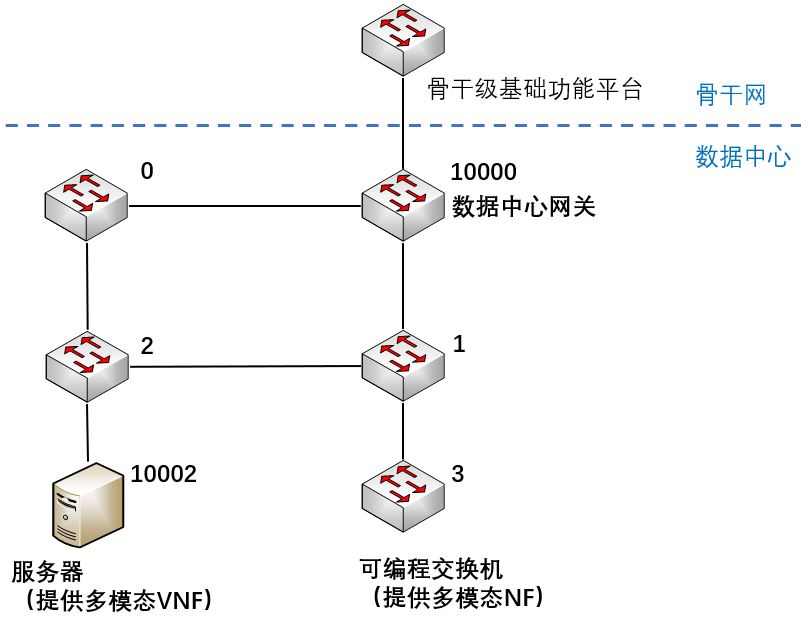

# 服务层向控制层发送的命令集

CMD_TYPE_ADD_SFC

CMD_TYPE_ADD_SFCI

CMD_TYPE_DEL_SFCI

CMD_TYPE_DEL_SFC

# 对控制层路由模态的假设

服务链支持的路由模态包括：
```
IPv4
基于身份的路由
基于地理位置的路由
基于内容的路由
```

# 对网络基础设施的假设

数据中心网络拓扑是预先设计并规划好的，例如FAT-TREE-K=32。

每台服务器，交换机具有一个全局唯一的ID（例如：0，1，2，......）。

假设0-10000是交换机的ID，10001以上是服务器的ID。

假设10000是数据中心网关交换机的ID。

每台交换机至少分配一个IPv4的网段。

每台服务器至少分配一个IPv4的地址。

一台交换机连接的所有服务器在同一个IPv4网段内。

有一台交换机作为数据中心网关，连接数据中心外的骨干级基础功能平台和数据中心内的其他交换机。

交换机和服务器数据平面支持多模态转发。

# 数据中心的网络功能服务

数据中心提供网络功能服务，面向的用户是网络运营商和内容提供商。

网络运营商有安全功能的需求，比如防火墙拦截某些ip的流量。

内容提供商有访问控制的需求，比如允许某些ip的流量访问特定内容。

数据中心提供的网络功能包括防火墙，限速器等等。

用户的流量从骨干网流入数据中心内，在数据中心内接受网络功能的服务，最后再流回骨干网。

# 用户的SFC请求

用户提交的服务链请求，包括:

* source节点和destination节点
    * source节点：默认是字符串"*"
    * destination节点：默认是字符串"*"

* Ingress节点和Egress节点
    * Ingress：默认是网关ID或者网关连接的分类器ID
    * Egress：默认是网关ID或者网关连接的分类器ID

## IPv4模态下的SFC请求场景

* match field
    * 用户的流量匹配域，比如5元组(src_ip, src_port, dst_ip, dst_port, proto)
    * 分类器/或者网关根据匹配域区分不同的用户流量

## 基于身份路由模态下的SFC请求场景

* match field
    * 用户的流量匹配域，比如用户的ID以及用户要通信的用户的ID
    * 分类器/或者网关根据匹配域区分不同的用户流量

## 基于地理位置路由模态下的SFC请求场景

* match field
    * 用户的流量匹配域，比如用户的GPS坐标以及用户要通信的用户GPS坐标
        * GPS坐标比如：[经度, 纬度]
    * 分类器/或者网关根据匹配域区分不同的用户流量

## 基于内容路由模态下的SFC请求场景

* match field
    * 用户的流量匹配域，比如用户的IPv4地址以及用户所需要的内容标识符
        * 内容标识符比如：
            * 电影名"Revenger4_4K"；
            * 在线视频网站的名称"iqiyi"；
    * 分类器/或者网关根据匹配域区分不同的用户流量

# 接口

## VNF ID
```
VNF_TYPE_CLASSIFIER = 0
VNF_TYPE_FORWARD = 1
VNF_TYPE_FW = 2
VNF_TYPE_IDS = 3
VNF_TYPE_MONITOR = 4
VNF_TYPE_LB = 5
VNF_TYPE_RATELIMITER = 6
VNF_TYPE_NAT = 7
VNF_TYPE_VPN = 8
VNF_TYPE_DDOS_SCRUBBER = 12
```

接口采用restful API，下面给出JSON格式的命令

## CMD_TYPE_ADD_SFC
sfc规定了用户的哪些流要进入该sfc以及服务链的网络功能顺序
```
{
    "cmdType": "CMD_TYPE_ADD_SFC",
    "cmdID": "cd2a5ab8-57f6-11eb-9013-1866da864c17",
    "sfcUUID": "cd2a5ab8-57f6-11eb-90f3-1866da864c17",
    "routingMorphic": "MORPHIC_IPV4",
    "vNFTypeSequence": [
        6, 2
    ],
    "zone": "PROJECT3_ZONE",
    "ingress": 10000,
    "egress": 10000,
    "source": {
        "IPv4": "*"
    },
    "destination": {
        "IPv4": "*"
    },
    "match": {
        "srcIP": "*",
        "dstPort": "*",
        "dstIP": "*",
        "srcPort": "*",
        "proto": "*"
    }
}

{
    "cmdType": "CMD_TYPE_ADD_SFC",
    "cmdID": "c32a5ab8-57f6-11eb-90f3-1866da864c17",
    "sfcUUID": "cd2a5ab8-57f6-11eb-90f3-1866da864c17",
    "routingMorphic": "MORPHIC_IDENTITY",
    "vNFTypeSequence": [
        6, 2
    ],
    "zone": "PROJECT3_ZONE",
    "ingress": 10000,
    "egress": 10000,
    "source": {
        "Identity": "*"
    },
    "destination": {
        "Identity": "1"
    },
    "match": {
        "srcIdentity": "*",
        "dstIdentity": "1"
    }
}


{
    "cmdType": "CMD_TYPE_ADD_SFC",
    "cmdID": "cd2a5a18-57f6-11eb-90f3-1866da864c17",
    "sfcUUID": "cd2a5ab8-57f6-11eb-90f3-1866da864c17",
    "routingMorphic": "MORPHIC_GEO",
    "vNFTypeSequence": [
        6, 2
    ],
    "zone": "PROJECT3_ZONE",
    "ingress": 10000,
    "egress": 10000,
    "source": {
        "Geo": [133.0, 23.0]
    },
    "destination": {
        "Geo": [130.0, 20.0]
    },
    "match": {
        "srcGeo": [33.0, 123.0],
        "dstGeo": [30.0, 120.0]
    }
}


{
    "cmdType": "CMD_TYPE_ADD_SFC",
    "cmdID": "cd2a5ab8-57f6-11eb-90f3-1826da864c17",
    "sfcUUID": "cd2a5ab8-57f6-11eb-90f3-1866da864c17",
    "routingMorphic": "MORPHIC_CONTENT",
    "vNFTypeSequence": [
        6, 2
    ],
    "zone": "PROJECT3_ZONE",
    "ingress": 10000,
    "egress": 10000,
    "source": {
        "IPv4": "*"
    },
    "destination": {
        "Content": "iqiyi"
    },
    "match": {
        "Content": "iqiyi"
    }
}


```

## CMD_TYPE_ADD_SFCI
sfci规定了SFC的一个instance

拓扑示例：



```
{
    "cmdID": "cd2a3ab8-57f6-11eb-90f3-1866da864c17", 
    "cmdType": "CMD_TYPE_ADD_SFCI",
    "vnfiSequenceLength": 1,
    "sfcUUID": "cd2a5ab8-57f6-11eb-90f3-1866da864c17",
    "sfciID": 2, 
    "forwardingPath": [
        [
            10000,5, 6, 8
        ],
        [
            8, 6, 4, 9999,
            0, 2, 10002
        ],
        [
            10002, 2, 1, 10000
        ]
    ], 
    "vnfi_0": {
        "vnfiID": "f89ee971-57f8-11eb-90f3-1866da864c17", 
        "vnfType": 6, 
        "nodeID": 8, 
        "memory": null, 
        "config": null, 
        "cpu": null
    },
    "vnfi_1": {
        "vnfiID": "f89ee111-57f8-11eb-90f3-1866da864c17", 
        "vnfType": 2, 
        "nodeID": 10002, 
        "memory": 1024, 
        "config": null, 
        "cpu": 2
    }
}
```

## CMD_TYPE_DEL_SFCI
```
{
    "cmdID": "c32a5ab8-57f6-11eb-90f3-1866da864c17", 
    "cmdType": "CMD_TYPE_DEL_SFCI",
    "sfciID": 3
}
```

## CMD_TYPE_DEL_SFC
```
{
    "cmdID": "cd2a5ab8-57f6-11eb-33f3-1866da864c17", 
    "cmdType": "CMD_TYPE_DEL_SFC",
    "sfcUUID": "5997b582-57fc-11eb-90f3-1866da864c17"
}
```
