# 用户需求

## 一、用户

| 名称          | 人数          | 描述  |
| :----------- |:------------  | :-----|
| SFC业务的租户    | 1k量级 |  登陆公有云SFC业务界面，选购所需的VNF并指定VNF的顺序以便于组成服务功能链；  提供每个VNF的配置规则；  提供SFC的服务等级指标（Service Level Indicator，SLI）；  通过NFV管理和编排系统查看每条SFC的服务等级指标；  删除已经购买的SFC业务 |
| 公有云SFC业务运维人员      | 10个运维人员，1个主管| 通过NFV管理和编排系统查看每条SFC的服务等级指标 |

## 二、需求获取和分析

### 1、功能性需求

#### 运维人员需求

1. 一个NFV管理和编排系统；

2. 通过Web页面来操作NFV管理和编排系统；

3. 允许通过Web页面的方式申请、查看和删除SFC；

4. 允许通过Web页面的方式上传VNF配置规则；

5. 支持SFC基本的CRUD功能：增加(Create)、读取(Retrieve)、更新(Update)和删除(Delete)；

6. NFV管理和编排系统的SFC编排结果必须满足SFC请求中的服务等级目标（Service Level Objective, SLO）；

7. 通过NFV管理和编排系统的Web页面实时查看每条SFC的服务等级指标（Service Level Indicator，SLI），包括SFC的时延、丢包率、吞吐量、VNF/server的IP地址，VNF instance的数量和VNF的资源使用情况；可以实时获知每条SFC是否出现了故障，故障保护是否成功，故障恢复是否成功；可以实时获知每条SFC的资源利用率，是否需要垂直扩展和水平扩展；

8. NFV管理和编排系统可以在故障保护后进行故障恢复，比如SFC 1的某一个节点故障，首先启动故障保护功能保障SFC业务不中断，然后启动故障恢复功能重新部署受故障影响VNF，最后重新收敛转发路径（被恢复的主VNF变成备份VNF）；（非项目需求）

9. NFV管理和编排系统可以应对流量动态变化，并且水平扩展的转发路径依旧可以被故障保护和故障恢复；（非项目需求）

10.NFV管理和编排系统支持异构设备，包括x86和p4。支持在P4交换机上部署NF例如防火墙，NAT，LB，Monitor等。支持在x86设备比如通用服务器上部署VNF例如防火墙，NAT，LB，VPN，Monitor等。

11.支持多种寻址和路由机制。必须支持IPv4路由机制。支持通用地址映射，例如通过IPv4地址获取内容标识ID，或者通过IPv4地址获取身份标识ID。

#### 租户1（南北向流量）的需求

1. 租户1的网站部署在该公有云上；[\[1\]][1] （该场景与移动核心网的SFC服务类似，同属南北向流量）

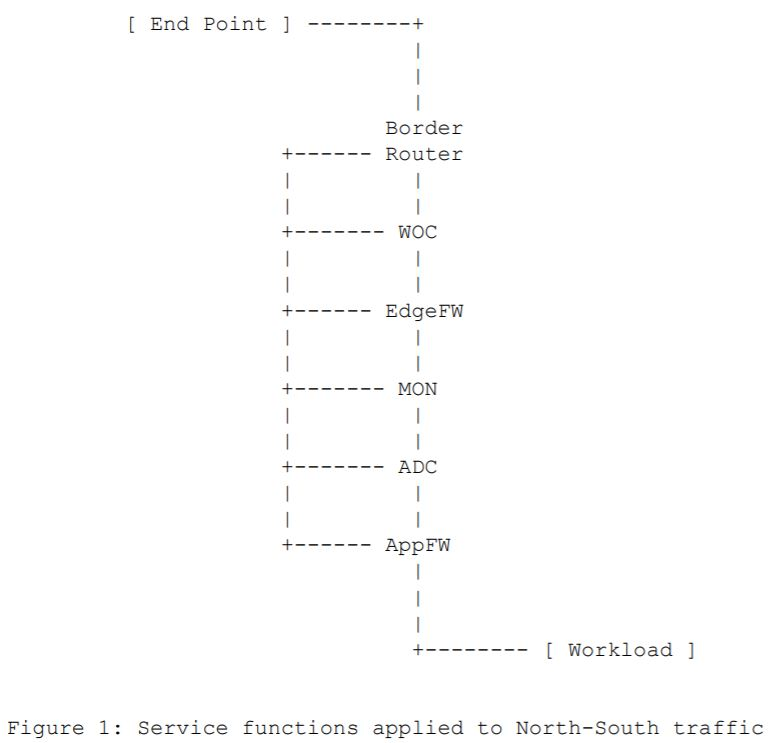

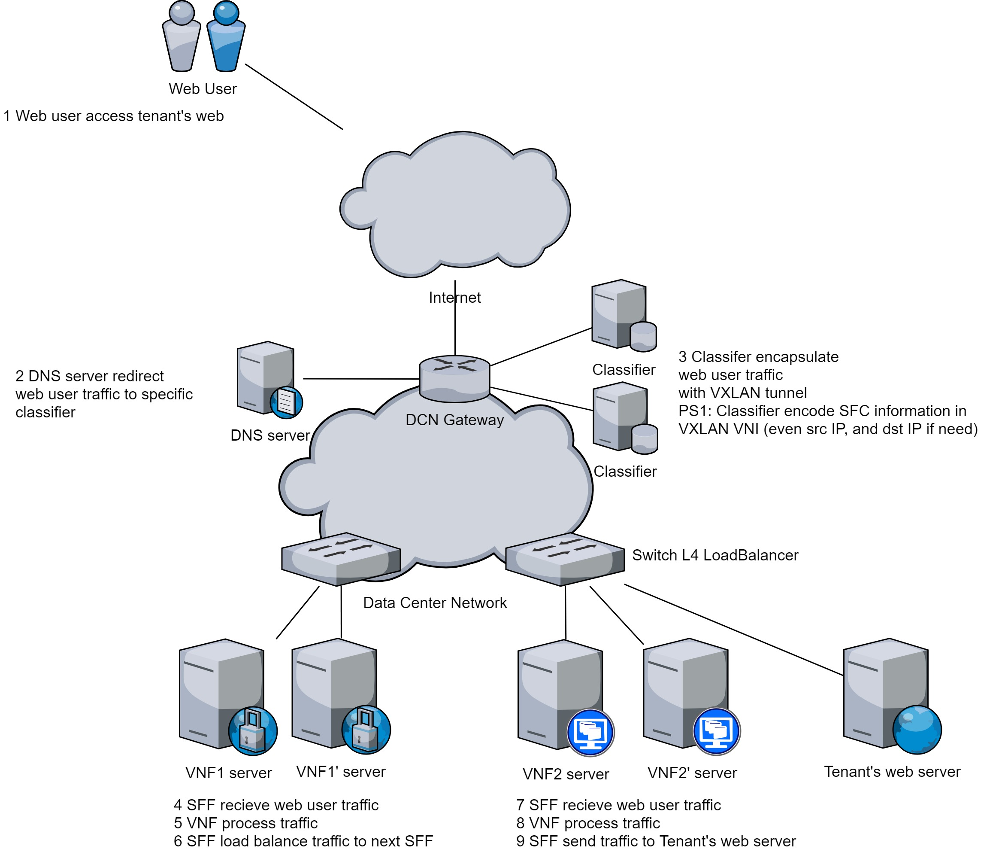

2. 通过Web的方式申请、查看和删除SFC；

3. 可以让到达租户网站的流量经过租户所要求的SFC；

4. 按照租户提出的规则配置每一个VNF;

5. 不能影响租户的正常业务，比如正常流量可以访问其网站；

6. 满足1k个类似租户的SFC部署，平均每个租户服务的用户数为1k；（DCN网关需要对1k x 1k = 1M的聚合流进行流分类）

#### 租户2（东西向流量）的需求（PS：租户1的需求已经可以用于项目展示了，所以租户2的需求暂时不做）

1. 租户2的网站部署在该公有云上，他希望在其网站后端之间（Web<-->App<-->DataBase）增加SFC；[\[1\]][1]

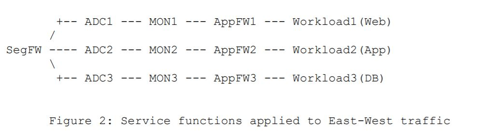

2. 通过Web的方式申请、查看和删除SFC；

3. 租户的VM A（Web）访问VM B（App）的流量，以及VM B访问VM C（DataBase, DB）的流量经过租户所要求的SFC；

4. 按照租户提出的规则配置每一个VNF;

5. 不能影响租户的VM之间的正常通信；

### 2、非功能性需求（这部分可以提出更高的需求，自然变成一项研究）

运维人员需求：

1. 单节点故障保护率100%；（故障保护：发生硬件/软件故障后，利用预留的资源恢复SFC）（非项目需求）

2. 水平扩展时间低于10s；（水平扩展：在第二台server上启动新的VNF实例，占用额外的资源来处理更多的流量）（非项目需求）

3. 垂直扩展时间低于1s；（垂直扩展：VNF在同一台server上占用更多的资源来处理更多的流量）（非项目需求）

4. 随机性失效和人为蓄意扰动抑制率>95%；（故障恢复：发生硬件/软件故障后，重新部署SFC）（项目需求：抑制率>95%）

5. DCN网关支持百万级的流表分类；（需要对流量进行分类，识别出每个流所属的SFC，并实现SFC）（项目需求：万台服务器数据中心开展应用）

6. 故障恢复时间低于10s；（故障恢复：发生硬件/软件故障后，临时分配资源恢复SFC）（非项目需求）

7. 支持在异构设备上部署服务功能，包括P4，x86（项目需求：多模态）

8. 支持各种路由寻址机制，包括IPv4，基于身份标识的路由（项目需求：多模态）

租户的需求：

1. NF种类要求：FW, Monitor, traffic shaping（NF需要支持IPv4，还有其他协议，比如基于身份标识的路由等。NF要具有协议通用性）

2. SFC顺序要求：比如FW -> Load Balancer

3. 可用度要求：包括>99.5%、>99.9%、>99.99%、>99.999%、99.9999%

4. 丢包率要求：比如小于5%

5. 吞吐量要求：包括100Mbps、300Mbps、1Gbps

6. 时延要求：比如<20ms、<50ms、<100ms

7. 业务类型：指标有3个分别是时延、带宽和可用度。一共5种业务，包括工业控制（时延可用度敏感）、远程医疗（时延带宽可用度敏感）、智能家居（带宽敏感）、网站访问（时延敏感）、用户虚机（不敏感）。

## 三、需求建模（TODO）

### 3.1 角色

1. 租户：通过Web提交SFC请求以及VNF配置规则；实时查看SFC的SLI
2. 运维人员：通过Web提交SFC请求以及VNF配置规则；实时查看每个租户SFC的SLI
3. Server Controller：
    - 根据NFV管理和编排系统的编排部署命令，向server上下发“部署/删除/扩缩容/故障恢复/迁移VNF”（docker python api）命令，向Software Router上下发转发表项(bess gRPC)
    - 从server/Software Router收集信息，并向NFV管理和编排系统汇报server的资源使用情况
4. Server: VNF的载体
5. Software Router：运行在服务器上的服务功能转发器（Service Function Forwarder, SFF）
6. Network Controller：
    - 根据NFV管理和编排系统的编排部署命令，向SDN交换机下发转发路径
    - 根据NFV管理和编排系统的查询请求和RIB，查询相关SDN交换机和server上软件交换机（可以是Software Router，VPP，BESS等等）的流表，并将流表信息汇报给NFV管理和编排系统
    - 作为一个测量系统组件，与所有SDN交换机和软件交换机交互并获得全局拓扑，并汇报给NFV管理和编排系统
7. SDN switch：
    - 根据Network Controller的流表下发命令，实现SFC转发
    - 接收Network Controller的查询命令，向Network Controller汇报转发表项（可用于debug）
8. VNF库：存储预先配置好的VNF容器镜像（分布式地存储在每台server上）
9. DCN信息库：
    - 网络拓扑信息（P4/SDN交换机与软件交换机连接而成的网络拓扑）
    - SFC信息，包括SFC的ID，每个VNF的配置规则文件，SFC的非功能性需求，VNF/Server资源使用信息，VNF实例数量，故障信息，VNF的编址，SFC的转发路径路由表项
10. Classifier：
    - 部署在DCN网关处，负责对聚合流进行分类，并给属于不同SFC的流打标签
    - 无论如何实现（基于P4或者基于server），Classifer作为一种VNF，它由Server Controller管理

### 3.2 UML

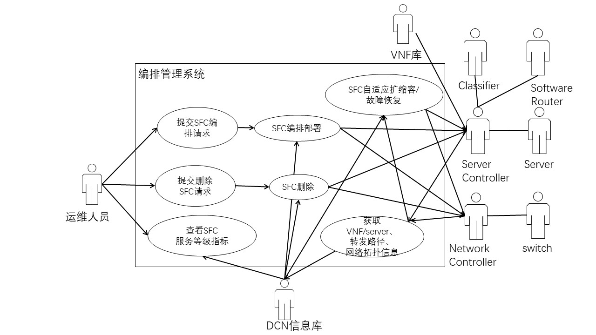
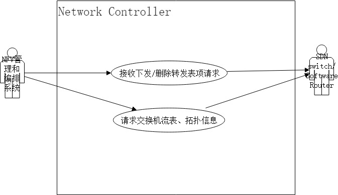
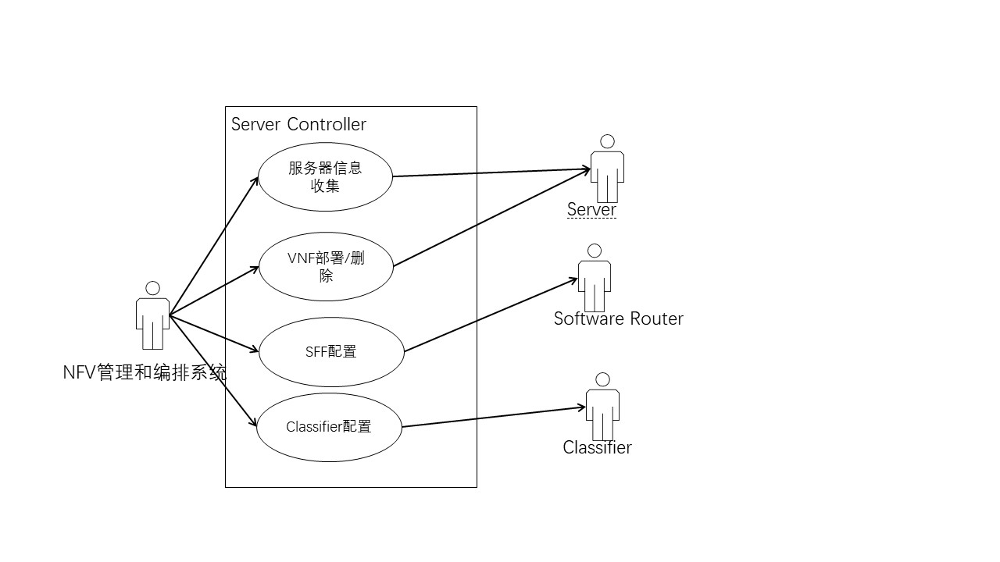

### 3.3 用例场景

#### 

#### 提交SFC编排请求

| ID和名称        | 请求编排SFC           |
| ------------- |:-------------|
| 创建人      | User1|
| 首要角色      | 发起SFC请求的运维人员      |
| 描述 | 运维人员/租户通过web页面输入SFC请求来指定要编排的VNF种类&顺序&SLA。系统返回SFC请求处理状态（接受处理/正在处理/处理成功）      |
|触发条件 |请求者表示他需要编排一个SFC|
|前置条件 ||
|后置条件 |1.SFC请求被存储在DCN信息库中;  2.SFC请求被发送给SFC编排用例;  3.用户可以通过系统检查SFC的部署状态|
|正常流程  |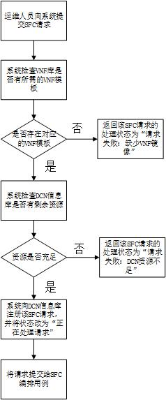|
|异常 |无|
|优先级 |无|
|假设 |无|

#### 提交SFC删除请求

|ID和名称 |请求删除SFC|
| ------------- |:-------------|
| 创建人      | User1|
|首要角色 |发起SFC请求的运维人员|
|描述 |运维人员输入SFC删除请求（一个SFC ID）来指定要删除的SFC。系统返回SFC删除请求处理状态（接受处理/正在处理/处理成功）|
|触发条件 |请求者表示他需要删除一个SFC|
|前置条件 |1. DCN信息库存在需要被删除的SFC|
|后置条件 |1.成功将SFC删除请求提交给SFC删除用例|
|正常流程  |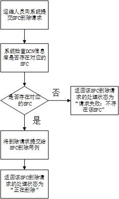|
|异常 |无|
|优先级 |无|
|假设 |无|

#### 查看SFC服务等级指标

|ID和名称 |SFC|
| ------------- |:-------------|
| 创建人      | User1|
|首要角色 |运维人员、DCN信息库|
|描述 |根据运维人员的查看请求，实时地从DCN信息库获取特定SFC的信息，包括SFC请求的状态，VNF-server对应关系，VNF 实例数量，转发路径，吞吐量、时延、丢包率|
|触发条件 |运维人员打开NFV管理和编排系统的界面，并指定查看的SFC|
|前置条件 |1. 指定的SFC存在于DCN信息库|
|后置条件 |1. NFV管理和编排系统界面显示所查看的SFC的请求状态、VNF实例数量、转发路径、服务等级指标信息|
|正常流程  |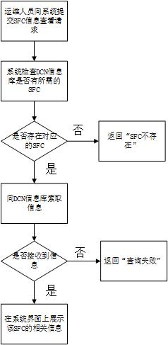|
|异常 |无|
|优先级 |无|
|假设 |无|

#### SFC编排部署

| ID和名称        | SFC编排部署           |
| ------------- |:-------------|
| 创建人      | User1|
|首要角色 |发起SFC请求的运维人员/租户|
|描述 |根据SFC请求，决策每个VNF的故障保护policy（副本数量）； 决策每个VNF的扩展policy（CPU利用率触发条件）； 计算每个VNF instance（包括首要VNF、备份副本和扩展副本）的部署位置； 计算主路径、备份路径； 将VNF instance、VNF instance的部署policy、位置信息和用户指定的VNF配置规则下发给Server controller和Network controller； 将主备路径转发表项发送给Network Controller；|
|触发条件 |接收到SFC请求|
|前置条件 |1. 每台服务器（Node）必须提前打好标签（用于决策VNF的部署位置，可以通过nodeSelector来实现将特定的VNF部署到一个特定的node）|
|后置条件 |1.成功向 Server Controller发送首要VNF、备份VNF的部署（包括配置规则）的信息;  2.成功向Network Controller发送主备路径信息和VNF部署信息; 3.DCN信息库更新该SFC请求的处理状态|
|正常流程  |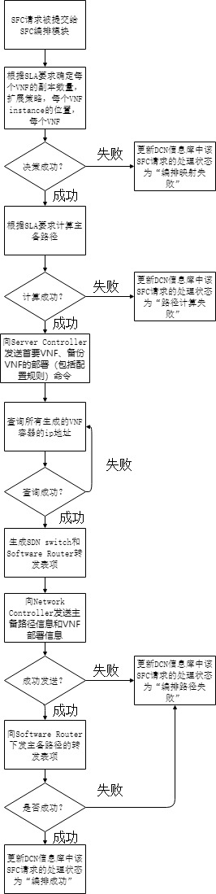|
|异常 |无|
|优先级 |无|
|假设 |无|

#### SFC删除

|ID和名称 |删除SFC|
| ------------- |:-------------|
| 创建人      | User1|
|首要角色 |发起SFC删除请求的运维人员|
|描述 |根据SFC删除请求，查询DCN信息库获取相应SFC的所有信息包括：主备VNF的部署位置，主备转发路径经过的SDN/Software Router交换机对应的路由表项；
|触发条件 |接收到SFC删除请求|
|前置条件 |1.存在该SFC |
|后置条件 |1.成功向 Server Controller发送要删除的SFC信息；  2.成功向Network Controller发送要删除的流表； 3.DCN信息库更新该SFC的状态为已删除|
|正常流程  |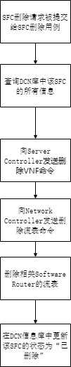|
|异常 |无|
|优先级 |无|
|假设 |无|

#### 获取VNF/server、转发路径、网络拓扑信息

|ID和名称 |SFC|
| ------------- |:-------------|
| 创建人    | User1|
|首要角色 |Server Controller、Network Controller|
|描述       |以固定的时间间隔10s为一个周期获取全局信息，包括VNF和server的对应关系，每个VNF/server的资源使用情况（CPU，内存），网络拓扑信息，每个SDN交换机的流表； 将所收集的信息转换为DCN信息库支持的格式；更新DCN信息库；|
|触发条件 |计时器时间增至10s（然后清零）|
|前置条件 |1. NFV管理和编排系统与Server Controller、Network Controller和DCN信息库已经建立好连接|
|后置条件 |1.成功更新DCN信息库的SFC请求信息，包括每条SFC的实时VNF instance数量，VNF和server的对应关系，转发路径； 2.获得SFC状态变化结果，包括拓扑的变化，VNF存活状态（用于触发故障恢复），VNF资源利用率增长/减少变化（用于触发扩容/缩容） |
|正常流程   |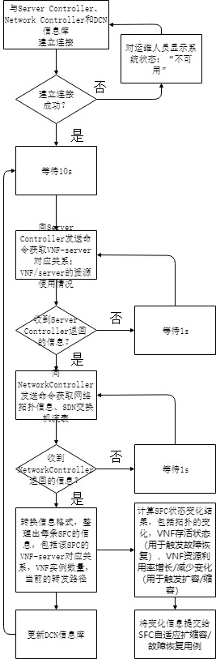|  
|异常       |无|
|优先级     |无|
|假设       |无|

#### SFC自适应扩缩容故障恢复

|ID和名称 |SFC自适应扩缩容故障恢复|
| -------- |:-------------|
| 创建人    | User1|
| 首要角色 |无|
| 描述      |根据SFC变化信息，决策每个SFC是否需要扩缩容，是否需要故障恢复； 通过扩缩容编排算法/故障恢复编排算法计算新的VNF部署位置和转发路径； 通过Server Controller部署新的VNF，通过Network Controller更新转发表项|
| 触发条件 |接收到SFC变化信息|
| 前置条件 |1. 无|
| 后置条件  |1. 扩容：成功增加VNF实例并迁移流量； 2. 缩容：成功迁移流量并删除多余VNF实例； 3. 故障恢复：成功计算并部署新的VNF实例，更新流表 |
| 正常流程  |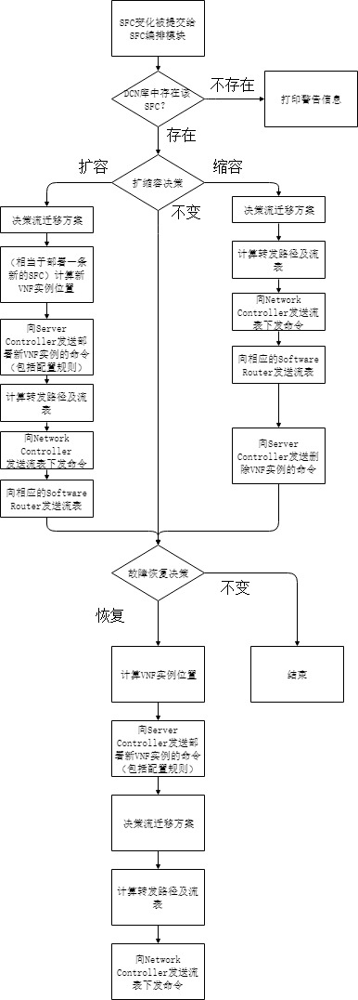|
| 异常      |无|
| 优先级 |无|
| 假设      |无|

#### 接收下发删除转发表项请求

|ID和名称 |SFC|
| ------------- |:-------------|
| 创建人      | User1|
|首要角色 |无|
|描述 |根据NFV管理和编排系统的流表下发/删除请求，下发/删除流表（需要强调的是，这个用例不负责计算路径，也不负责计算每个流表的match域和action域）；|
|触发条件 |接收到NFV管理和编排系统的流表下发请求|
|前置条件 |与NFV管理和编排系统建立连接；  与SDN交换机建立连接； 与Software Router建立连接（网络插件可能不支持Software Router接入控制器）；|
|后置条件 |成功下发/删除流表|
|正常流程  |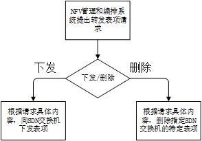|
|异常 |无|
|优先级 |无|
|假设 |无|

#### 请求交换机流表和拓扑信息

|ID和名称 |SFC|
| ------------- |:-------------|
| 创建人      | User1|
|首要角色 |无|
|描述 |根据NFV管理和编排系统的请求，收集交换机的流表和拓扑（包括交换机之间的连接关系，以及服务器连接于交换机的端口号）。|
|触发条件 |接收到NFV管理和编排系统的流表查询请求或者拓扑查询请求|
|前置条件 |与NFV管理和编排系统建立连接； 与SDN交换机建立连接； （可选）与Software Router建立连接（网络插件可能不支持Software Router接入控制器）；|
|后置条件 |成功查询流表/成功获取拓扑|
|正常流程  |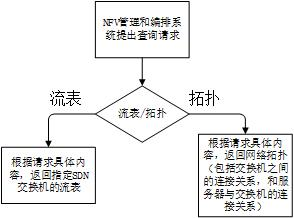|
|异常 |无|
|优先级 |无|
|假设 |无|

[1]: https://tools.ietf.org/pdf/draft-ietf-sfc-dc-use-cases-06.pdf "Title"